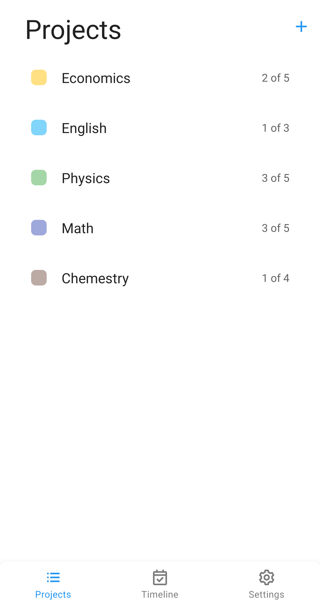
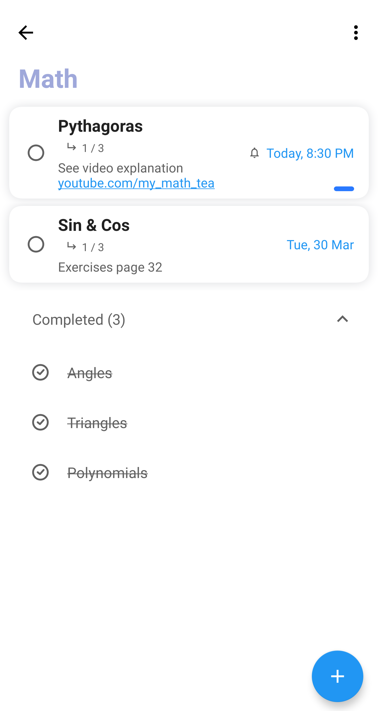
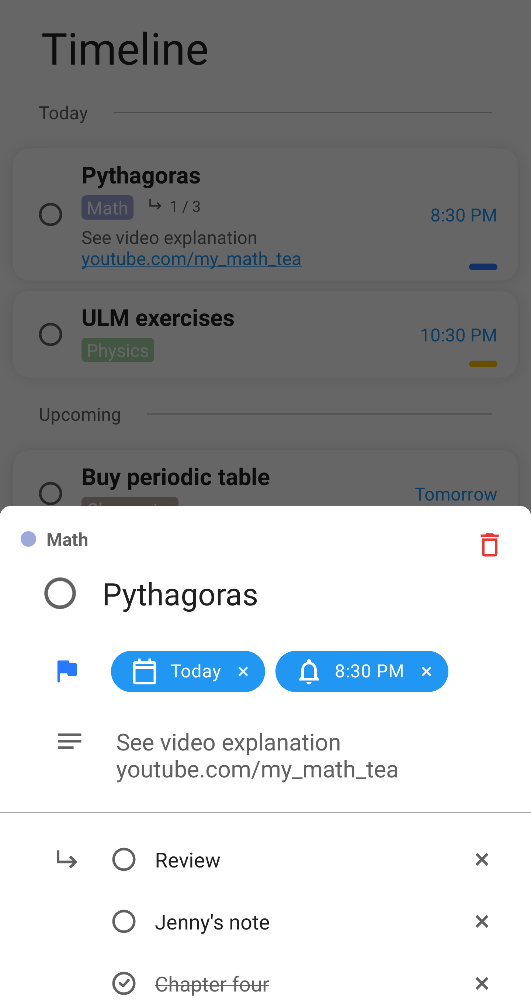
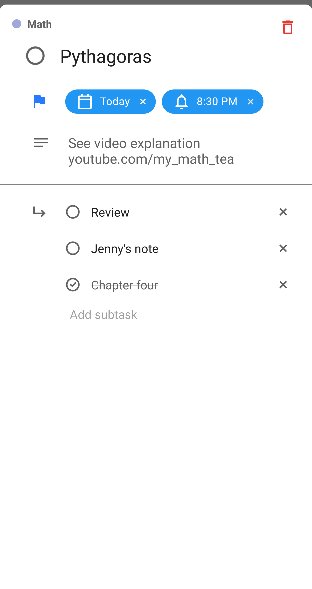
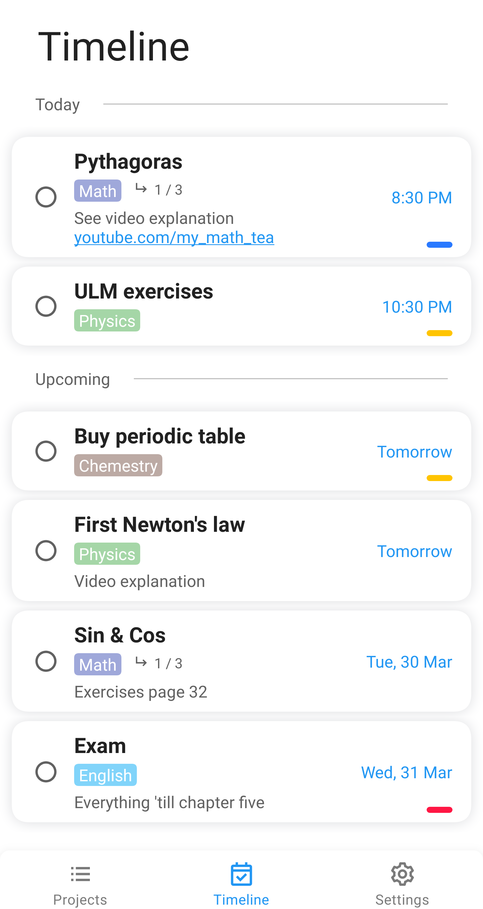
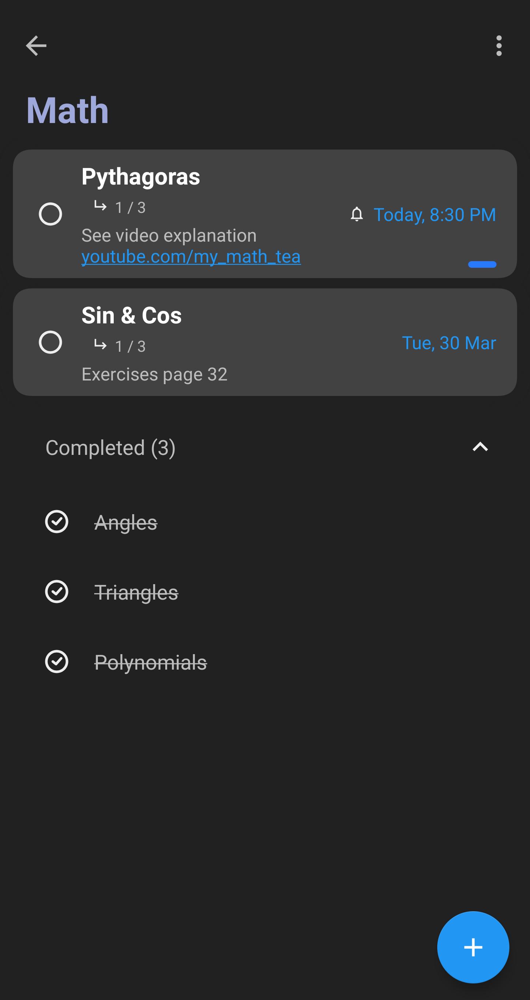

# Etude-Task
Simple To Do task (with some features). Create projects, tasks, subtasks, remindern and more.
Some used tools:
* MVVM Architecture
* Navigation Components
* Realm DB
* Work Manager

Screenshots
-----------
      
